# Launch and configure a WordPress instance on AWS Lightsail

## Amazon Lightsail

Amazon Lightsail is the easiest way to get started with Amazon Web Services (AWS). Lightsail includes everything we need to launch our project quickly, **instances (virtual private servers)**, **managed databases**, **SSD-based storage**, **backups (snapshots)**, **data transfer**, **domain DNS management**, **static IPs**, and **load balancers** for a low, predictable price.

### Step 1: Sign up for AWS

Amazon Lightsail requires an AWS account. Sign up for AWS, or sign in to AWS instead.

### Step 2: Create a WordPress instance

To create a Lightsail instance for WordPress
- Sign in to the **Lightsail console**
- On the **Instances** section of the Lightsail home page, choose **Create instance**.

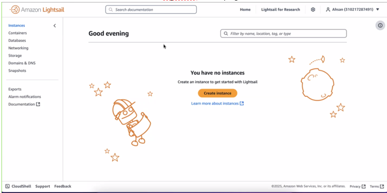

- Choose the AWS **Region** and **Availability Zone** for your instance.

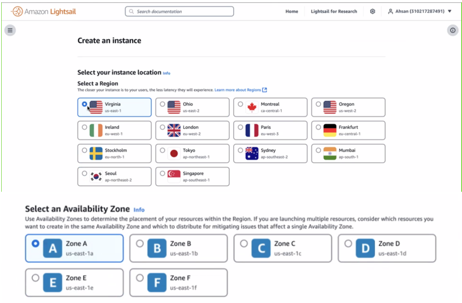

- Choose the image for instance as follows:
  - For **Select a platform**, choose **Linux/Unix**.

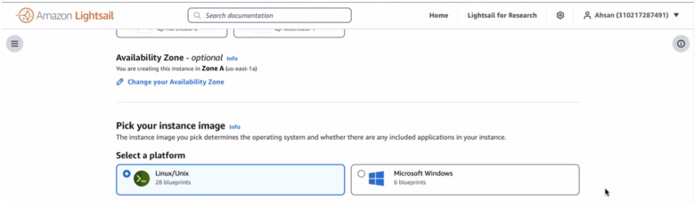

  - For Select a **blueprint**, choose **WordPress**.


- Generate or Select existing **SSH Key**

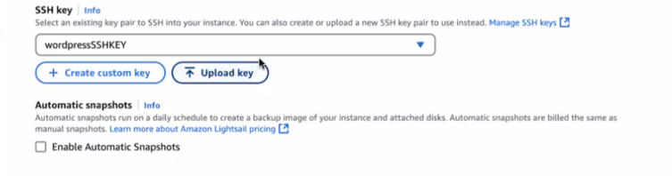

- Choose an **instance plan**.
A plan includes a machine configuration (**RAM**, **SSD**, **vCPU**) at a low, predictable cost, plus a data transfer allowance.

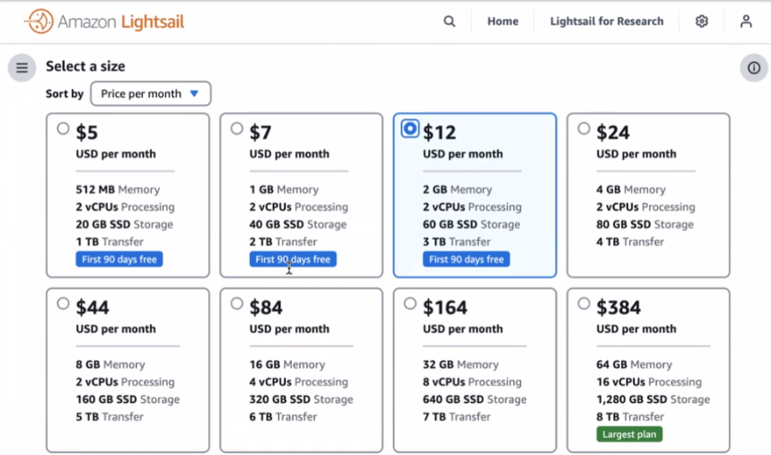

- Enter a **name** of instance.

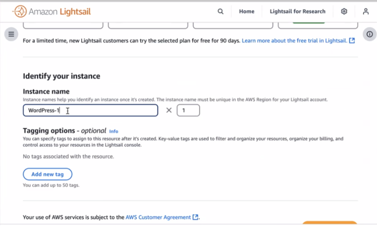

- Choose **Create instance**.

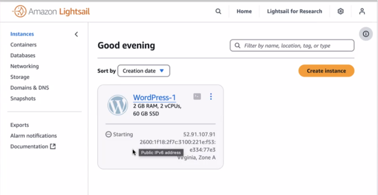

To view the test blog post, go to the instance management page and copy the public IPv4 address shown in the upper-right corner of the page. Paste the address into the address field of an internet-connected web browser. The browser displays the test blog post.

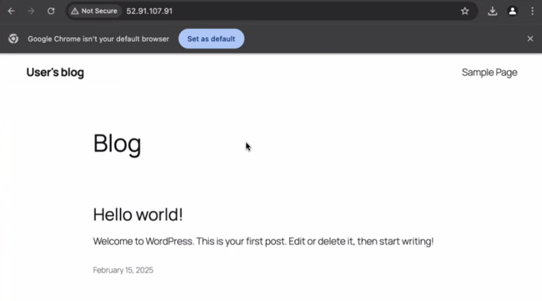

### Step 3: Get the admin password of WordPress website

The default password to sign in to the administration dashboard of our WordPress website is stored on the instance.

To get the default password for the WordPress administrator

- Open the instance management page of WordPress instance.
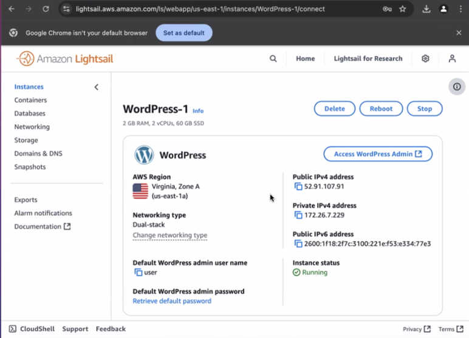

- On the **WordPress panel**, choose **Retrieve default password**. This expands **Access default password** at the bottom of the page.

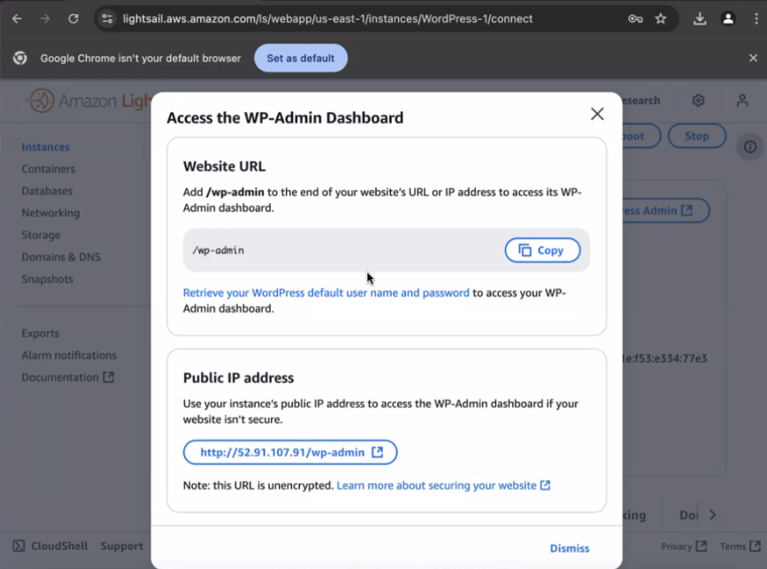

```bash
Admin Username: user

Admin Password: uUZwCN1JZXd.
```

### Step 4: Sign in to the administration dashboard of WordPress website

Now that we have the password for the administration dashboard of our WordPress website, we can sign in. In the administration dashboard, we can change our user password, install plugins, change the theme of our website, and more.

To sign in to the administration dashboard

- Open the instance management page of WordPress instance.
- On the **WordPress panel**, choose **Access WordPress Admin**.
- On the **Access your WordPress Admin Dashboard** panel, under **Use public IP address**, choose the link with this format: http://public-ipv4-address./wp-admin
- For **Username** or **Email Address**, enter `user`.
- For **Password**, enter the password obtained in the previous step.
- Choose Log in

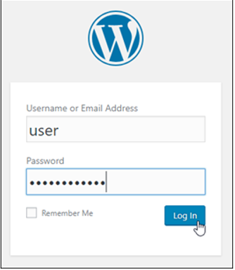

We are now signed in to the administration dashboard of our WordPress website where we can perform administrative actions.

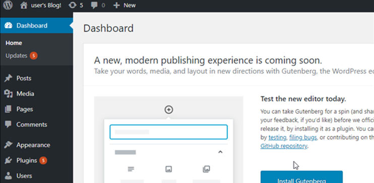

## Database

#### Steps to Configure and Access the Database

Retrieve Database Credentials
- Connect to our **Lightsail Instance**:
- Go to the **Lightsail console**.
- Click on our **WordPress instance**.
- Click the **Connect using SSH button** to open a browser-based SSH terminal.

#### Find the Database Credentials:

Run the following command to retrieve the database and password:

```bash
cat bitnami_credentials
```

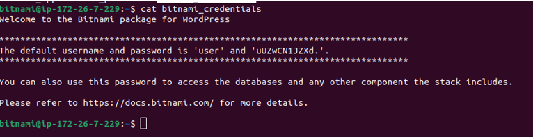

The password is use for both purpose,

- for admin portal password
- for database password

#### Database WordPress Configuration:

Open the WordPress configuration file (wp-config.php) for editing:

```bash
sudo nano /opt/bitnami/wordpress/wp-config.php
```

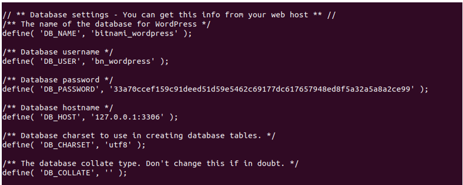

#### Connect to the Database

Enter the password
`33a70ccef159c91deed51d59e5462c69177dc617657948ed8f5a32a5a8a2ce99`

