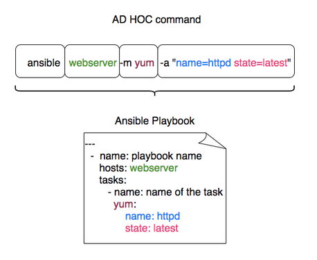
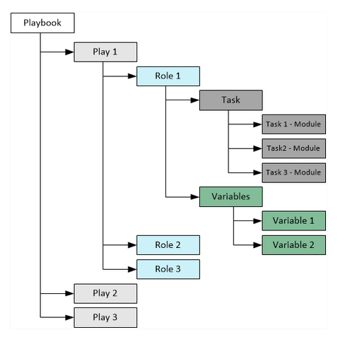

# Ansible Playbook

Ansible Playbooks offer a repeatable, reusable, simple configuration management and multi-machine deployment system, one that is well suited to deploying complex applications. If we need to execute a task with Ansible more than once, write a playbook and put it under source control. Then we can use the playbook to push out new configuration or confirm the configuration of remote systems.



### Components
An Ansible playbook is a YAML file that contains a list of **plays**. Each play targets specific **hosts** defined in our inventory and comprises multiple **tasks**. A task represents a single **action**, such as executing a command, running a script, installing a package, or restarting a service.




### Sample Playbook
```bash
- name: Configure Apache Web Servers
  hosts: localhost
  tasks:
    - name: Execute command 'date'
      command: date

    - name: Execute script on server
      script: test_script.sh

    - name: Install httpd service
      yum:
        name: httpd
        state: present

    - name: Start web server
      service:
        name: httpd
        state: started
```

### Multiple Plays in a Single Playbook
```bash
- name: Play 1
  hosts: localhost
  tasks:
    - name: Execute command 'date'
      command: date

    - name: Execute script on server
      script: test_script.sh

- name: Play 2
  hosts: localhost
  tasks:
    - name: Install web service
      yum:
        name: httpd
        state: present

    - name: Start web server
      service:
        name: httpd
        state: started
```

To run Ansible playbook
```bash
ansible-playbook <playbook-filename>
ansible-playbook playbook.yml
```

### Verify Playbook

#### Check Mode
Ansible’s check mode is a **dry-run** feature that simulates the execution of playbook without making any changes to the hosts. It clearly shows what changes would be made if the playbook were executed in a live environment. To run a playbook in check mode, simply add the `--check` option.

```bash
ansible-playbook install_nginx.yml --check
```

#### Diff Mode
Diff mode provides a **before-and-after** comparison by showing the differences between the current system state and the state after applying the playbook. This feature is especially useful when we need to understand precisely what changes will be made. To enable diff mode, include the `--diff` option when running playbook

```bash
ansible-playbook configure_nginx.yml --check --diff
```

#### Syntax Check Mode
Before executing any playbook, it’s essential to ensure that YAML syntax is correct. Ansible offers a syntax check mode which quickly validates playbook, catching potential syntax errors early. Use the `--syntax-check` option to perform this verification

```bash
ansible-playbook configure_nginx.yml --syntax-check
```

### Ansible lint

Ansible Lint is a command-line tool designed for linting playbooks, roles, and collections. It meticulously scans Ansible code for potential errors, bugs, stylistic issues, and suspicious constructs.

**Command**

```bash
ansible-lint style_example.yml
```
