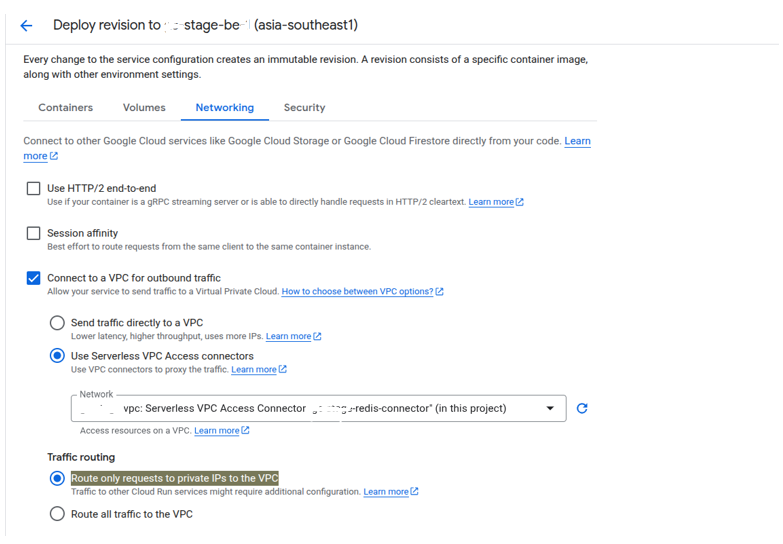
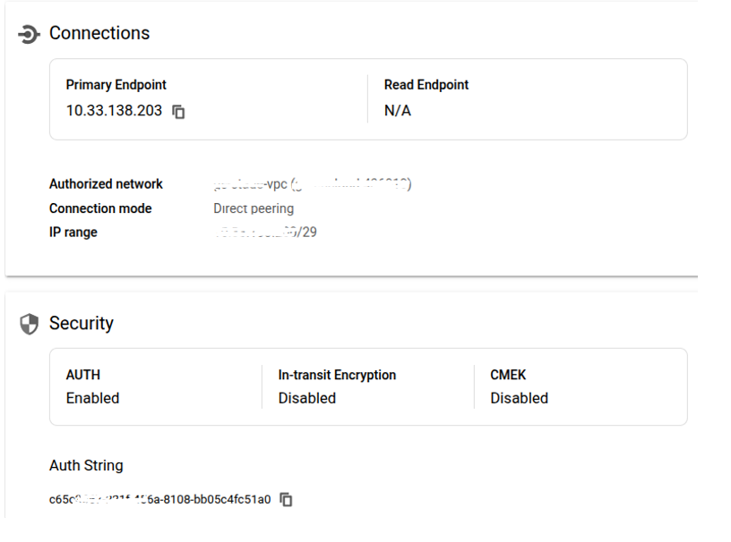

# Connecting Google Cloud Run to Memorystore (Redis) with AUTH

## Overview
This document describes how to securely connect a Google Cloud Run service to a Google Cloud Memorystore for Redis instance with AUTH enabled, using a **Serverless VPC Access connector**.

## Prerequisites
- Cloud Run service deployed in the same GCP project.
- Redis (Memorystore) instance with AUTH enabled.
- VPC network where Redis is deployed.
- Serverless VPC Access connector configured and attached to the same VPC.

## Redis Instance Setup
1. Go to **GCP Console → Memorystore → Redis**
2. Create or configure an instance:
   - Select **Private IP**
   - Choose your **VPC network**
   - Enable **AUTH** at the time of creation
     - The **auth string** is autogenerated after the creation of Redis.

## Serverless VPC Access Connector
Navigate to the VPC that Redis is connected to:

1. Go to **VPC Network → Serverless VPC Access**
2. Create a connector:
   - **Region**: Same as your Redis service/VPC.
   - **VPC**: Same as your Redis instance.
   - **Name**: e.g., `serverless-vpc-connector`
   - **IP range**: e.g., `10.8.0.0/28` (must not conflict with existing subnets).

## Cloud Run Configuration

To connect your Cloud Run service to your Redis instance via a Serverless VPC Access connector, follow these steps:

1. Go to **Cloud Run**
   - Open the GCP Console
   - Click on your **Cloud Run service name**
2. Click **Edit & Deploy New Revision**
   - In the service overview page, click the **Edit & Deploy New Revision** button.
3. Configure VPC Connector
   - Scroll down to the **Connections** section.
   - Expand **VPC connector**
   - From the Connector dropdown, select your **Serverless VPC Access connector** (e.g., `serverless-vpc-connector`).
   - Under **Traffic Routing**, select:
     - **Route only requests to private IPs to the VPC**



### Add Environment Variables
- Update environment variables in your Cloud Run service container configuration according to the Redis instance details.
- Retrieve the **Redis port** and **Redis password** from the Redis service.



## Connectivity Test
From within the Cloud Run logs or your app, ensure the following:
- Redis is reachable at the internal IP
- Authentication succeeds (no `NOAUTH Authentication required` errors)
- You see `Connected to Redis!` or equivalent message.

### Command for Verification
```bash
redis-cli -h <private-ipaddress> -p <port> -a <string-auth>
```

> **Note**:  
> This command is used for verification if testing Redis connectivity from a VM. Both Redis and the VM must be on the same VPC.

