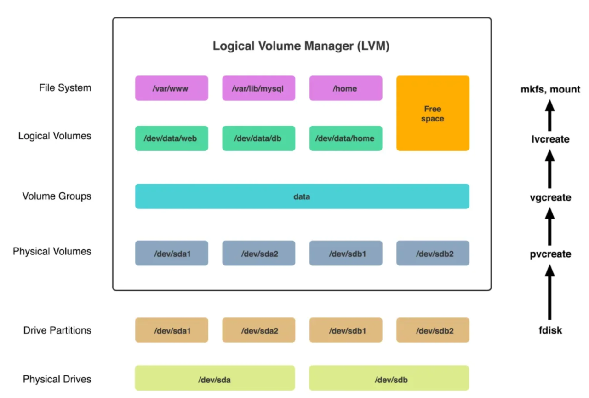

# Logical Volume Management (LVM) Guide

Logical Volume Management (LVM) is a method of flexible disk space management in Linux.  
It provides:
- Ability to add disk space to a logical volume and its filesystem, while mounted and active.
- Combining multiple physical hard drives into a single Volume Group (VG).
- Splitting Volume Groups into Logical Volumes (LVs).

## LVM Architecture

### Physical Volume (PV)
A physical volume is a partition or whole disk designated for LVM use.

### Volume Group (VG)
A volume group is a collection of physical volumes, creating a pool of disk space for allocation.

### Logical Volume (LV)
A logical volume represents a usable storage device that can be formatted and mounted.



## Create LVM

### 1. Check Attached Disk
```bash
lsblk
sudo fdisk -l /dev/sdc
```

Expected output:
```
does not contain a valid partition table
```

### 2. Partition the Disk
```bash
sudo fdisk /dev/sdc
```
Steps inside `fdisk`:
- `n` → New partition  
- `p` → Primary  
- Accept defaults for partition number, start, and end  
- `t` → Change partition type → set to `8e` (Linux LVM)  
- `w` → Write changes and exit  

Update kernel for disk information:
```bash
partprobe
lsblk
```

Now you should see `/dev/sdc1`.

### 3. Create Physical Volume
```bash
pvcreate /dev/sdc1
pvs
```

### 4. Create Volume Group
```bash
vgcreate data /dev/sdc1
vgs
vgdisplay
```

### 5. Create Logical Volume
```bash
lvcreate -n backup -l +100%FREE data
lvs
lvdisplay
```

### 6. Format Partition
```bash
sudo mkfs.ext4 /dev/mapper/data-backup
```

### 7. Mount the Disk
```bash
sudo mkdir -p /mnt/newdisk
sudo mount /dev/mapper/data-backup /mnt/newdisk
df -h
```

## Extend LVM

If you need more space, add a new disk and extend the volume.

### 1. Check Attached Disk
```bash
lsblk
sudo fdisk -l /dev/sdd
```

Expected output:
```
does not contain a valid partition table
```

### 2. Partition the Disk
```bash
sudo fdisk /dev/sdd
```
Steps inside `fdisk`:
- `n` → New partition  
- `p` → Primary  
- Accept defaults  
- `t` → Change partition type → `8e` (Linux LVM)  
- `w` → Save and exit  

Update kernel:
```bash
partprobe
lsblk
```

Now you should see `/dev/sdd1`.

### 3. Create Physical Volume
```bash
pvcreate /dev/sdd1
```

### 4. Extend Volume Group
```bash
vgextend data /dev/sdd1
```

### 5. Extend Logical Volume
```bash
lvextend -l +100%FREE /dev/mapper/data-backup
```

### 6. Resize Filesystem
```bash
resize2fs /dev/mapper/data-backup
df -h
```

## Summary
- LVM provides flexible storage management.  
- Physical Volumes → grouped into Volume Groups → split into Logical Volumes.  
- Logical Volumes can be resized by adding new disks and extending volume groups.  
