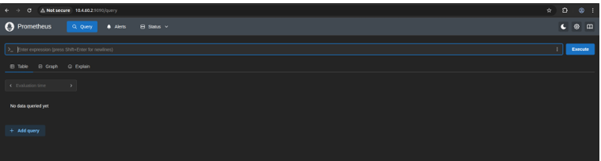
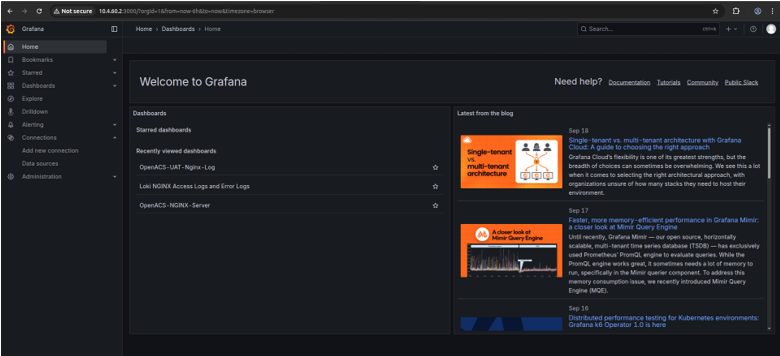
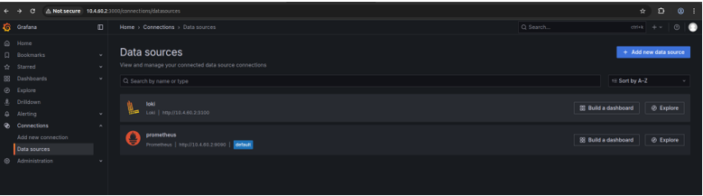

# Prometheus and Grafana Setup Guide

## Prometheus

We are configuring our Prometheus on the Server through Docker

**Connect to the Server via SSH and run the following commands.**

Create Directories for Persistent Storage

```bash
sudo mkdir -p /opt/prometheus/{data,config}
```

Set proper permissions

```bash
sudo chmod 755 /opt/prometheus
sudo chown -R root:root /opt/prometheus
```

Set proper permission of the data directries in Prometheus and Grafana
g
```bash
cd /opt/prometheus
chmod -R 777 data
```

Create Prometheus Configuration file

```bash
cd /opt/prometheus/config/
touch prometheus.yml
```

Add the below content, we can also add the other jobs later in our configuration file

```yaml
global:
  scrape_interval: 15s
  evaluation_interval: 15s
scrape_configs:
  - job_name: 'prometheus'
    static_configs:
      - targets: ['localhost:9090']
```

Create Docker Network

```bash
docker network create monitoring
```

If we don't have **internet access on server** then import the Prometheus image otherwise run `docker pull` command on the server

Run this command on local

```bash
docker pull prom/prometheus:latest
```

Zip this image

```bash
docker save --o prometheus-image.tar prom/prometheus:latest
```

Transfer the **prometheus-image.tar** file to the server.

Then load the tar file on server by

```bash
docker load --i prometheus-image.tar
```

Run Prometheus Container

```bash
docker run -d --name prometheus -p 9090:9090 --network monitoring --restart always -v
/opt/prometheus/config/prometheus.yml:/etc/prometheus/prometheus.yml -v
/opt/prometheus/data:/prometheus prom/prometheus:latest
```

Check Prometheus container

```bash
docker ps | grep prometheus
```

Check Logs

```bash
docker logs prometheus
```

Hit the URL via browser: **http://<Server_IP>:9090**



## Grafana

Create Directories for Persistent Storage

```bash
sudo mkdir -p /opt/grafana/{data,config}
```

Set proper permissions

```bash
sudo chmod 755 /opt/grafana
sudo chown -R root:root /opt/grafana
```

Set proper permission of the data directories in Grafana

```bash
cd /opt/grafana
chmod -R 777 data
```

If we don't have **internet access on server** then import the Grafana image otherwise run `docker pull` command on the server

Run this command on local

```bash
docker pull grafana/grafana:latest
```

Zip this image

```bash
docker save --o grafana-image.tar grafana/grafana:latest
```

Transfer the **grafana-image.tar** file to the server.

Then load the tar file on server by

```bash
docker load --i grafana-image.tar
```

Run Grafana Container

```bash
docker run -d --name grafana -p 3000:3000 --network monitoring --restart always -v /opt/grafana/data:/grafana -e GF_SECURITY_ADMIN_USER=fort -e GF_SECURITY_ADMIN_PASSWORD=fort@123 grafana/grafana:latest
```

***Note: change the user and Password***

Access the Grafana through browser: ***http://<Server_IP>:3000***



## Connect Grafana to Prometheus

- Login **Grafana** → **Connection** → **Data Sources** → **Add Data Sources**
- Give the Name: **Prometheus**
- Select **Prometheus** as Data Source
- Add URL: ***http://<Server_IP>:9090***
- Save



## Node_Exporter

Node Exporters are commonly used to monitor system-level application insights. The tool specifically provide node and container statistics, which allow developers to analyse real-time metrics of containers and nodes.

Edit the Prometheus configuration file and add the ***node_exporter*** job in it.

```bash
sudo nano /opt/prometheus/config/ prometheus.yml
```

Add the ***node_exporter*** job
```bash
global:
  scrape_interval: 15s
  evaluation_interval: 15s
scrape_configs:
  - job_name: 'prometheus'
    static_configs:
      - targets: ['localhost:9090']
  
  - job_name: 'node_exporter'
    static_configs:
      - targets: ['<Server_IP>:9100']
```

Save the file, then restart Prometheus conatiner:

```bash
docker restart prometheus
```

If we don't have **internet access on server** then import the **Node Exporter** image otherwise run `docker pull` command on the server

Run this command on local

```bash
docker pull prom/node-exporter:latest
```

Zip this image

```bash
docker save --o node-exporter-image.tar prom/node-exporter:latest
```

Transfer the **node-exporter-image.tar** file to the server.

Then load the tar file on server by

```bash
docker load --i node-exporter-image.tar
```

Run Node Exporter Conatiner

```bash
docker run -d --name node-exporter -p 9100:9100 --network monitoring --restart always prom/node-exporter:latest
```

Verify container check if it's running:

```bash
docker ps | grep node-exporter
```

Open in browser:

**http://<Server_IP>:9100/metrics** → you should see raw metrics.

In Prometheus (**http://<Server_IP>:9090**), go to **Status** → **Targets** and check if **node-exporter:9100 is UP.**

### Import Node Exporter Dashboards

Grafana has ready-made dashboards for Node Exporter.

- In Grafana left menu → + (Create) → Import Dashboard.
- Enter this ID from Grafana.com dashboards:
- **1860** → Node Exporter Full (most popular).
- Click Load, then select your Prometheus data source.
- Click **Import**.

## Loki + Promtail

### Loki

Create directories

```bash
mkdir -p /opt/loki/chunks /opt/loki/rules /opt/loki/config
```

Create Loki Configuration file

```bash
touch /opt/loki/config.loki-config.yaml
```

Add the content in the Loki configuration file

```yaml
auth_enabled: false

server:
  http_listen_port: 3100

common:
  path_prefix: /loki
  storage:
    filesystem:
      chunks_directory: /loki/chunks
      rules_directory: /loki/rules
  replication_factor: 1
  ring:
    instance_addr: 127.0.0.1
    kvstore:
      store: inmemory

schema_config:
  configs:
    - from: 2024-01-01
      store: tsdb
      object_store: filesystem
      schema: v13
      index:
        prefix: index_
        period: 24h
```

If we don't have **internet access on server** then import the Loki image otherwise run `docker pull` command on the server

Run this command on local

```bash
docker pull grafana/loki:latest
```

Zip this image

```bash
docker save --o loki-image.tar grafana/loki:latest
```

Transfer the **loki-image.tar** file to the server.

Then load the tar file on server by
```bash
docker load --i loki-image.tar
```

Run Docker container

```bash
docker run -d --name loki -p 3100:3100 --network monitoring --restart always -v /opt/loki/config/loki-config.yaml:/etc/loki/local-config.yaml grafana/loki:latest
```

Verify Loki Container is Running

```bash
docker ps | grep loki
```

Check through browser URL

```bash
http://<Server_IP>:3100/ready
```

#### Configure Grafana to Use Loki

- Go to **http://<Server_IP>:3000** → Login with your admin user/pass.
- Login **Grafana** → **Connection** → **Data Sources** → **Add Data Sources**
- Give the Name: **Loki**
- Select **Loki** as Data Source
- Add URL: **http://<Server_IP>:3100**
- Click Save & Test

Now you can go to Explore → `Loki` and see logs!

## Promtail

Create the config directory and file:

```bash
sudo mkdir -p /opt/promtail/config
sudo nano /opt/promtail/config/promtail-config.yaml
```

Paste this config into **/opt/promtail/config/promtail-config.yaml**

```yaml
server:
  http_listen_port: 9080
  grpc_listen_port: 0

positions:
  filename: /tmp/positions.yaml

clients:
  - url: http://<Server_IP>:3100/loki/api/v1/push

scrape_configs:
- job_name: system
  static_configs:
  - targets:
      - Localhost
    labels:
      job: varlogs
      host: server-<IP>
      __path__: /var/log/*log

- job_name: nginx
  static_configs:
  - targets:
      - Localhost
    labels:
      job: nginx-logs
      host: server-<IP>
      __path__: /var/log/nginx/*log
```

If we don't have **internet access on server** then import the Promtail image otherwise run `docker pull` command on the server

Run this command on local

```bash
docker pull grafana/promtail:latest
```

Zip this image

```bash
docker save --o promtail-image.tar grafana/promtail:latest
```

Transfer the **promtail-image.tar** file to the server.

Then load the tar file on server by

```bash
docker load --i promtail-image.tar
```

Run Promtail Container
```bash
docker run -d --name promtail --network monitoring --restart always -v /opt/promtail/config/promtail-config.yaml:/etc/promtail/config.yml -v /var/log:/var/log:ro grafana/promtail:latest
```
