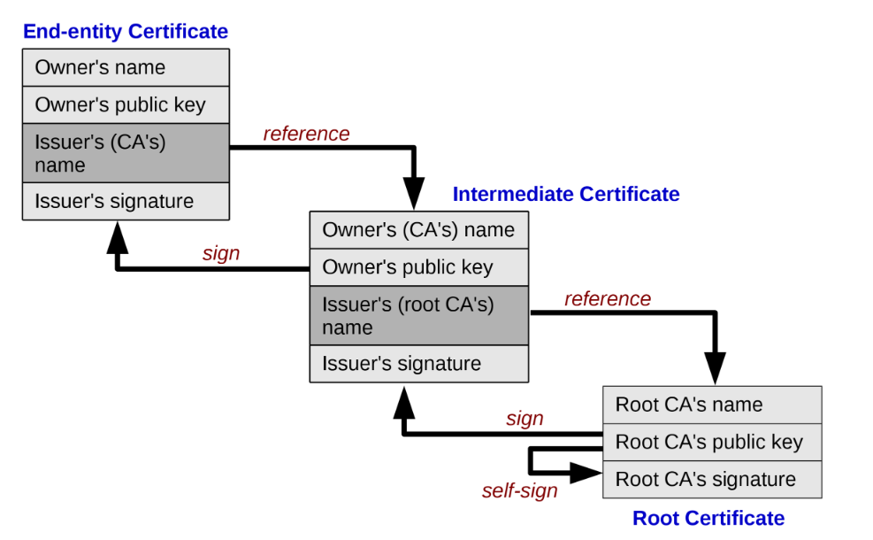

# 🔐 Digital Signatures, Digital Certificates & Trust Chain

# Digital Signature

A digital signature is an electronic, encrypted, stamp of authentication on digital information such as email messages, macros, or electronic documents. A signature confirms that the information originated from the signer and has not been altered.

Digital signature uses **Asymmetric cryptography**, which means a public key algorithm is employed.

## Workflow

### Signing Phase (Sender's Side)

#### Create Hash of Document

The original document is processed through a **cryptographic hash function** (like SHA-256 or SHA-512). This produces a fixed-size "digest" or "fingerprint" of the document.  
> Even a tiny change in the document creates a completely different hash

#### Encrypt Hash with Private Key

The sender uses their private key to encrypt the hash. This encrypted hash is the **digital signature**

#### Attach Signature to Document

The digital signature is bundled with the original document. The signature is typically embedded in the file or sent as a separate attachment

#### Send Complete Package

The sender transmits the `original document` + `digital signature` + `their public key`. The public key is freely shared and allows anyone to verify the signature

### Verification Phase (Recipient's Side)

#### Receive and Extract

Recipient receives the document and its attached digital signature.

#### Decrypt Signature

Using the sender's public key, the recipient decrypts the digital signature. This reveals the original hash value that the sender created

#### Create New Hash

The recipient independently creates a hash of the received document. Uses the same hash algorithm the sender used

#### Compare Hashes

The decrypted hash (from signature) is compared to the newly generated hash.  
If they match: The signature is valid - document is authentic and unmodified  
If they don't match: The signature fails - document was altered or the signature is fraudulent

## Problem with Digital Signature

Digital signature itself does not verify the true identity of the sender and his public key. It only verifies that:
- The signature was created by whoever holds the corresponding private key
- The document hasn't been altered

But it does NOT inherently verify WHO that person actually is.
This is where **Digital Certificates** and **Certificate Authorities ( CA )** become essential

### Example scenario
If I send you a document with a digital signature and a public key, you can verify the signature is valid, but you have no way to know if that public key actually belongs to me or to an imposter pretending to be me.

> The Solution of this problem is `Digital Certificate`.

# Digital Certificate

A digital certificate is a file or electronic password that proves the authenticity of a device, server, or user through the use of cryptography and the **Public Key Infrastructure (PKI)**.  
Digital certificate is an electronic credential issued by a trusted third party ( CA ). It’s not only verifies the identity of the owner, but also verifies that the owner owns the public key. Think of it as a digital ID card or passport that proves "this public key genuinely belongs to this entity."  
Digital certificate is attached to the public key and sent to the receiver.

### Digital Certificate contains:

- **Subject Information:** Who the certificate belongs to
    - Name of person/organization
    - Email address
    - Domain name (for websites)
    - Organization details
- **Public Key:** The subject's public key that others will use to verify their signatures or encrypt messages to them
- **Issuer Information:** Which Certificate Authority (CA) issued and verified this certificate
- **Validity Period:** Certificate expiry Start and end dates
- **Serial Number:** Unique identifier for the certificate
- **Digital Signature of the CA:** The CA signs the entire certificate with their private key, proving they verified the information

## Workflow

### Signing Phase (Sender's Side)

#### Create Hash of Document

The original document is processed through a **cryptographic hash function** (like SHA-256 or SHA-512). This produces a fixed-size "digest" or "fingerprint" of the document.

#### Encrypt Hash with Private Key

The sender uses their private key to encrypt the hash. This encrypted hash is the **digital signature**

#### Certificate Attachment

A certificate that contains the signer’s public key, issued by a Certificate Authority (CA), is attached along with the signature. Certificate verifies the identity of the signer.

#### Attach Signature to Document

The digital signature is bundled with the original document. The signature is typically embedded in the file or sent as a separate attachment

#### Send Complete Package

The sender transmits the `original document` + `digital signature` + `digital certificate`. The public key is freely shared and allows anyone to verify the signature

### Verification Phase (Recipient's Side)

#### Receive data

Recipient receives the document and its attached digital signature and digital certificate.

#### Identify the Sender and extract the public key of sender
The certificate is itself digitally signed by a CA.

The receiver reads the CA name in the certificate.  
The receiver uses the CA’s public key already trusted and stored in the OS/browser/device.  
The receiver verifies the CA’s signature on the certificate through public key of the CA stored in the OS/browser/device.  

Once the certificate is trusted, the receiver extracts the public key from the certificate and uses it to verify the digital signature.

#### Decrypt Signature

Using the sender's public key in **digital certificate**, the recipient decrypts the digital signature. This reveals the original hash value that the sender created

#### Create New Hash

The recipient independently creates a hash of the received document. Uses the same hash algorithm the sender used

#### Compare Hashes

The decrypted hash (from signature) is compared to the newly generated hash.  
If they match: The signature is valid - document is authentic and unmodified  
If they don't match: The signature fails - document was altered or the signature is fraudulent

# E-Signature

An electronic signature is any electronic method used to indicate a person’s intent to sign, approve, or accept the contents of a document. It replaces handwritten signatures in digital form.  
It is the digital equivalent of a handwritten signature, but not necessarily cryptographically secure.

It can be as simple as:

- Typing a name
- Clicking “I Agree”
- Drawing a signature with a mouse or finger
- Uploading a scanned signature image

# Trust Chain
A Trust Chain (also called Certificate Chain of Trust) is a hierarchy of digital certificates that link the identity of the signer to a trusted root authority.

It ensures:
- The signer is who they claim to be
- The certificate is not forged
- The public key belongs to the claimed identity

### Trush Chain in Digital Signature
- Signer Cert → Verified using Intermediate CA
- Intermediate CA → Verified using Root CA
- Root CA → Trusted by default (stored in system trust store)

This chain creates **end-to-end trust**.  

