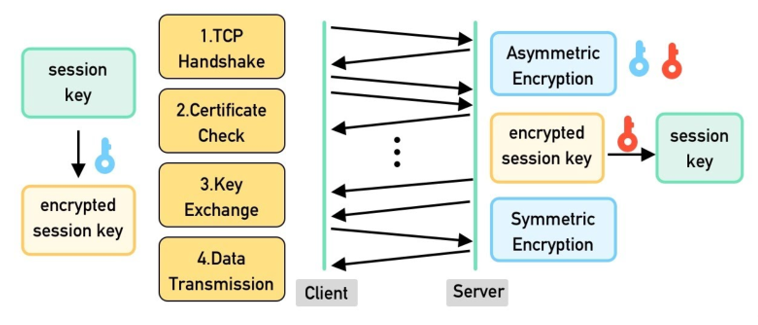
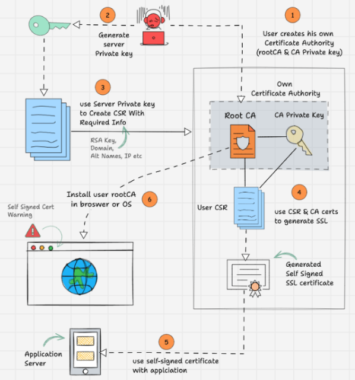

# SSL , TLS and mTLS Certificate

## SSL

The Secure Socket Layer (SSL) is a cryptographic protocol designed to provide secure communication over a computer network. It was developed by **Netscape** in the **1990s** to establish an encrypted link between the **web server** and a **web browser**. SSL operates by using encryption to secure the transmission of data ensuring that sensitive information such as credit card details and personal data remains confidential.

## TLS

The Transport Layer Security (TLS) is the successor to SSL and is designed to provide **improved security** and efficiency. TLS was developed as an enhancement of SSL to the address various vulnerabilities and to the incorporate modern cryptographic techniques. The first version, **TLS 1.0** was based on **SSL 3.0** but included significant improvements. TLS continues to evolve with the newer versions offering enhanced the security features.

## Difference Between Secure Socket Layer (SSL) and Transport Layer Security (TLS)

Both **SSL** and **TLS** are the protocols used to provide security between **web browsers** and **web servers**. The main difference between SSL and TLS is that, in SSL, the Message digest is used to create a master secret and it provides the basic security services which are Authentication and confidentiality. While in TLS, a Pseudo-random function is used to create a master secret.

## SSL/TLS Handshake:
The handshake protocol is basically used between a web client and web server to establish trust and then negotiate what secret key should be used to encrypt and decrypt the conversation.

## Difference between Self-Signed vs. Paid Certificates

### Paid SSL
Here's how to request a paid SSL/TLS certificate from a well-known Certificate Authority (CA) like **Verisign** or **Comodo**:

- Create a Certificate Signing Request (CSR) with a private key. The CSR includes details about your location, organization, and FQDN (Fully Qualified Domain Name).
- Send the CSR to the trusted CA.
- The CA will send you the SSL certificate, signed by their root certificate authority, along with a private key.
- Validate and use this SSL certificate with your applications.

Most browsers and operating systems store root CA certificates from all the trusted CAs. You can view them from the browser settings.

That is why browsers don’t show security messages when visiting websites using SSL from a trusted and well-known commercial CA.

Each browser has its own set of criteria and processes for accepting and trusting CAs.

**So, who decides if a CA can be trusted?** 

Well, they are vetted by independent audit organizations like webtrust. 

The results of these audits are crucial for a CA to be trusted by web browsers and operating systems.

For public endpoints, organizations always use paid certificates from well-known CAs.

### Self-Signed SSL
For a self-signed certificate

- Create your own root CA certificate and CA private key (acting as your own CA).
- Generate a server private key to create a CSR.
- Use the CSR to create an SSL certificate with your root CA and CA private key.
- Install the CA certificate in the browser or operating system to avoid https security warnings.

To learn these practically: [Reference Link](https://devopscube.com/create-self-signed-certificates-openssl/)

Typically, organizations manage their own PKI infrastructure for internal TLS certificate requests.   

